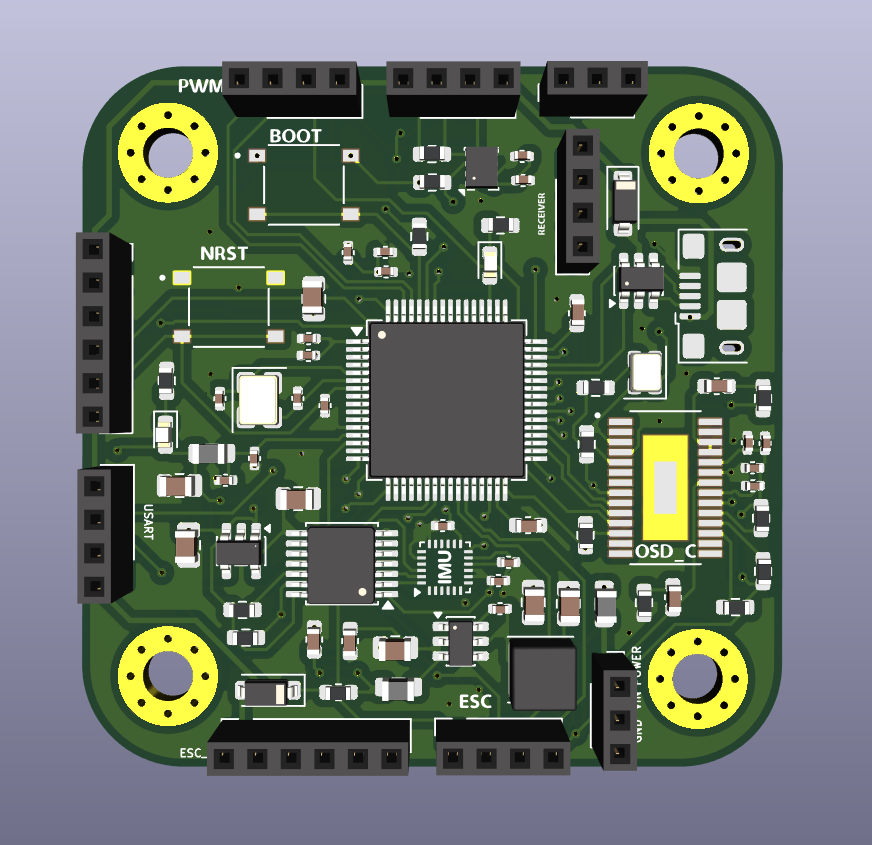
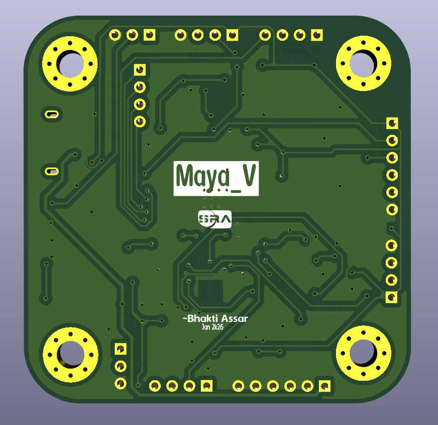
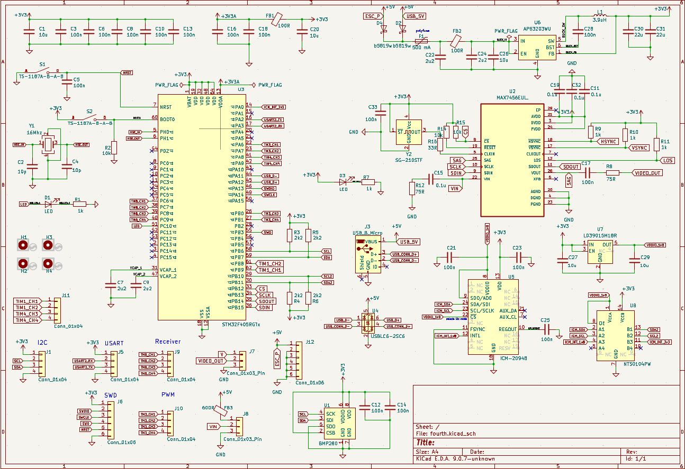
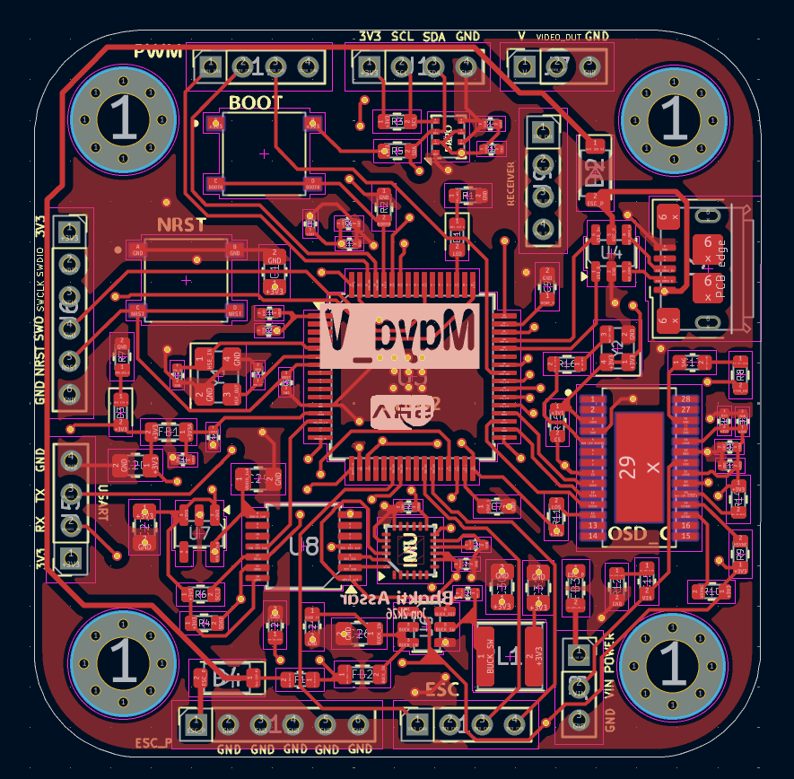
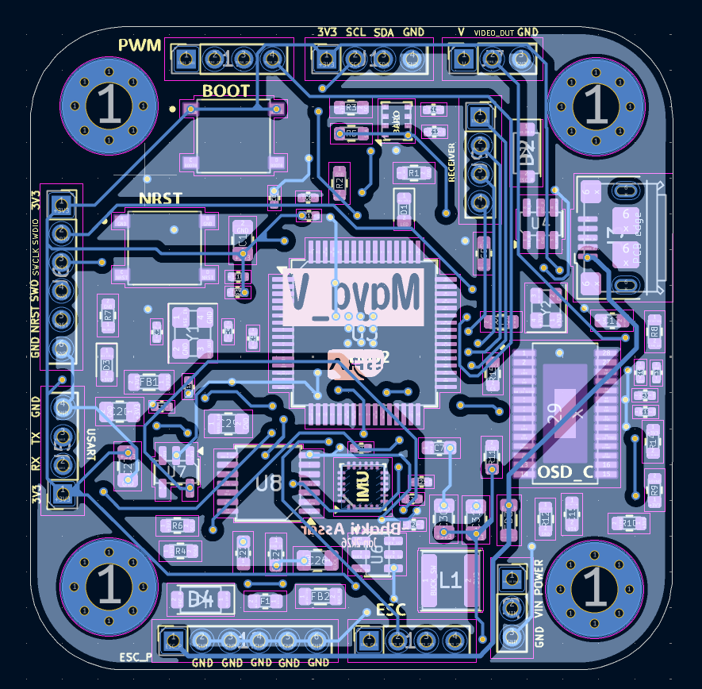

# Maya_V Flight Controller

This is a custom flight controller PCB designed for drones.

## PCB Preview

  
  

## Features

- **Microcontroller:** STM32F405  
- **IMU Sensor:** ICM-20948  
- **Barometer:** BMP280  
- **Video OSD:** MAX7456 
- **ESC Outputs:** 4× PWM channels (with extra PWM expansion)  
- **Communication Interfaces:** UART, I2C, USB  

## Hardware Design

### Schematic & PCB Layout

  

  
  

